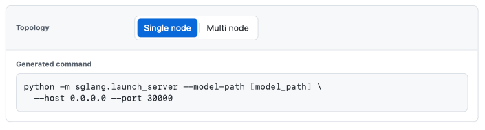

# sphinx-dynamic-command-builder

[](https://pypi.org/project/sphinx-dynamic-command-builder/)

Interactive command builders for Sphinx documentation.

`sphinx-dynamic-command-builder` adds a `dynamic-command` directive that renders a small selector UI from YAML and updates a generated command in the browser. It is useful for docs that need to show command-line examples assembled from several independent choices.

Demo: [GitHub Pages](https://aionw.github.io/sphinx-dynamic-command-builder/)

## Install

```bash
pip install sphinx-dynamic-command-builder
```

Then enable the extension in `conf.py`:

```python
extensions = [
    "sphinx_dynamic_command_builder",
]
```

## Usage

````md
```{dynamic-command}
base: python -m sglang.launch_server --model-path [model_path]
format:
  line_break: options
  indent: "  "
options:
  - label: Topology
    key: nodes
    default: single
    choices:
      - label: Single node
        value: single
        args: --host 0.0.0.0 --port 30000
      - label: Multi node
        value: multi
        args: --host 0.0.0.0 --port 30000 --disaggregation-ib-device mlx5_1
```
````

Rendered result:



Each option group is rendered as one selector row. Selecting a choice updates the generated command.

## YAML schema

See [Configuration](docs/configuration.md) for the full field reference and formatting rules.

- `base`: base command string.
- `command_label`: optional output label. Defaults to `Generated command`.
- `format.line_break`: optional command wrapping mode. Use `options` to put each `--option` group on its own shell-continuation line, or `none` to render a single line. Defaults to `options`.
- `format.indent`: optional indentation for continuation lines. Defaults to two spaces.
- `options`: list of option groups.
- `options[].label`: visible group label.
- `options[].key`: stable group key.
- `options[].default`: optional default choice value. Defaults to the first choice.
- `options[].choices`: list of choices.
- `choices[].label`: visible choice label.
- `choices[].value`: stable choice value.
- `choices[].env`: optional text prepended before the base command.
- `choices[].args`: optional text appended after the base command.
- `choices[].base`: optional replacement base command for this choice.

## Development

```bash
uv venv
uv pip install -e ".[test,docs]"
pytest
sphinx-build -M html docs docs/_build
```
